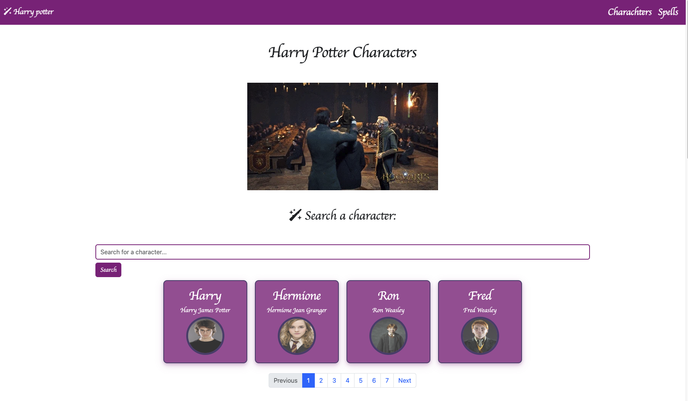
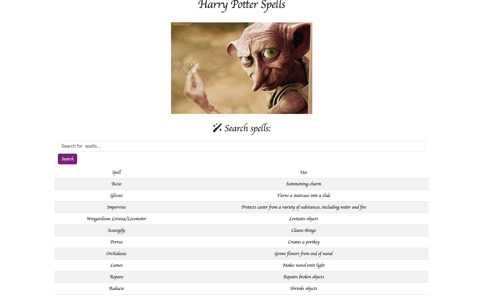
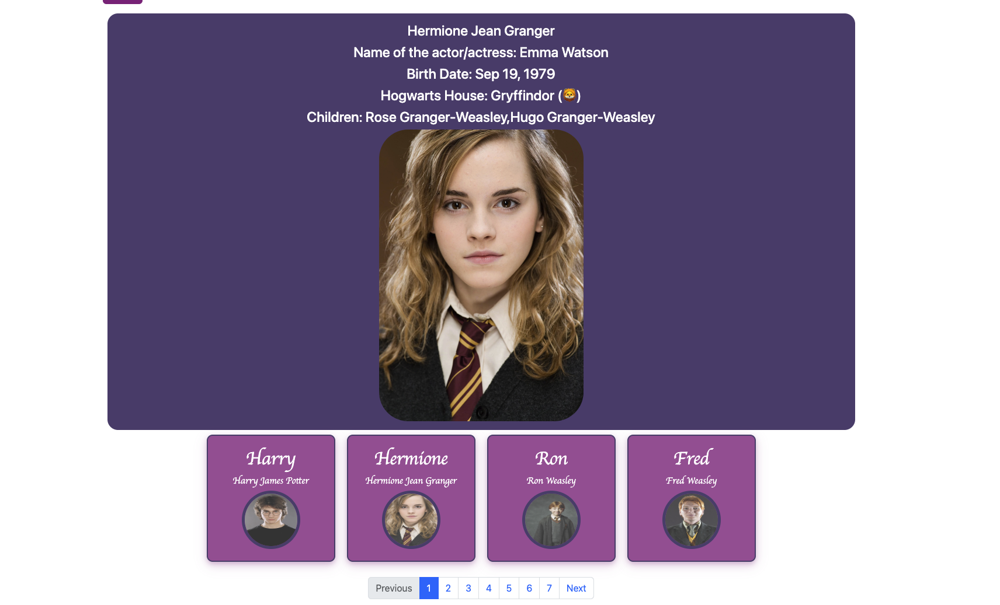

# Harry Potter Application

Welcome to the Harry Potter Application! This is a single-page web application that showcases characters, spells, and houses from the Harry Potter universe using Potter API. The project leverages modern JavaScript features and integrates with external APIs to provide a rich user experience.


## Features

### 1. Character Display
- Displays a list of Harry Potter characters with pagination.
- Search character names and read information about each of them
- Shows character details on click, including full name, actor/actress name, birth date, Hogwarts house, children, and image.
- Fetches character data from the API and dynamically creates HTML elements to display them.


### 2. Spells Display
- Displays a list of Harry Potter spells in a table format.
- Search spells names and read abot usage of them
- Supports pagination to navigate through the spells.
- Fetches spell data from the API and dynamically creates HTML elements to display them.

### 3. Houses Display
- Displays a list of Hogwarts houses with details like house name, emoji, founder, colors, and animal.
- Fetches house data from the API and dynamically creates HTML elements to display them.

### 4. Search Functionality
- Allows users to search for characters by name.
- Fetches and displays search results dynamically.

### 5. Responsive Design
- Uses Bootstrap for responsive design and layout.
- Ensures the application looks good on all device sizes.

### 6. Interactive Elements
- Hover effects and animations on character cards.
- Interactive pagination controls.

### 7. Footer
- A Bootstrap footer with links to Harry Potter movie characters and GitHub profiles.
- Uses FontAwesome icons for visual enhancement.








# Demo:
https://theharry-potter.netlify.app/

## API Endpoints

### Characters API
- `https://potterapi-fedeperin.vercel.app/en/characters`
- Allows searching for characters with query parameters.

### Spells API
- `https://potterapi-fedeperin.vercel.app/en/spells`
- Allows searching for spells with query parameters.

### Houses API
- `https://potterapi-fedeperin.vercel.app/en/houses`
- Provides details about the four Hogwarts houses.

## Setup and Installation

### Prerequisites
- Node.js and npm installed.
- Internet connection to fetch data from the APIs.

### Installation Steps

1. **Clone the Repository**
   ```
   git clone https://github.com/zahrajoulaei/harry-potter-applicaion

   cd harry-potter-application
   ```

2. **Install dependensies**

   ```
   npm install
   ```

3. **Run the application**

   ```
   npm install
   ```


3. **Open in Browser**
   .	
Open your browser and navigate to http://localhost:8080 to see the application in action.

## Usage

- **View Characters**: Navigate through the characters using the pagination controls. Click on a character to see detailed information.
- **Search Characters**: Use the search bar to find specific characters.
- **View Spells**: Navigate through the spells using the pagination controls.
- **View Houses**: Scroll down to see the list of Hogwarts houses with detailed information.

## Project Structure

- **index.html**: The main HTML file.
- **styles.css**: Custom styles for the application.
- **app.js**: Main JavaScript file that initializes the application.
- **src/**
  - **api.js**: Functions to fetch data from the APIs.
  - **characters.js**: Functions to display characters and handle pagination.
  - **spells.js**: Functions to display spells and handle pagination.
  - **houses.js**: Functions to display Hogwarts houses.

## Contributions

Feel free to fork this repository and submit pull requests. For major changes, please open an issue first to discuss what you would like to change.


## Contact

- **GitHub**: [zahra Joulaei](https://github.com/zahrajoulaei)
- **Email**: zahrajoulaei@gmail.com

Thank you for visiting the Harry Potter Application! Enjoy exploring the magical world of Harry Potter.